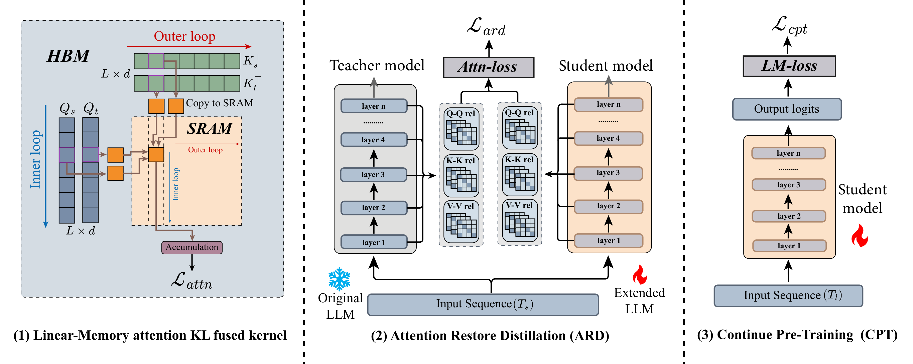

# LinearARD: Linear-Memory Attention Distillation for RoPE Restoration

## Overview

- This repository provides the reference implementation of **LinearARD**, a restoration distillation method for RoPE-scaled long-context LLMs.
- LinearARD aligns row-wise attention relation distributions (`Q/Q`, `K/K`, and `V/V`) between a frozen native-RoPE teacher and a RoPE-scaled student.
- The implementation uses an exact linear-memory KL kernel to avoid materializing full `n x n` relation maps during training.
- Reported in the paper: on context extension from `4K` to `32K`, LinearARD recovers short-text performance while keeping strong long-context robustness, with substantially lower token budget than heavy CPT baselines.

## Method



## Repository Structure

- `train.py` runs the training entrypoint.
- `scripts/` contains launcher scripts for training runs.
- `kernels/attention_KL/` contains the linear-memory attention KL kernel implementation.
- `data_loader.py` provides the dataset builder and dataloader utilities.

## Dependency

Install dependencies from `requirement.txt`:

```bash
pip install -r requirement.txt
```

dependency list:

- `torch==2.9.0+cu128`
- `transformers==4.45.2`
- `peft==0.18.1`
- `datasets==3.6.0`
- `tensorboard==2.20.0`
- `accelerate==1.12.0`
- `numpy==2.2.6`
- `tokenizers==0.20.3`
- `triton==3.5.0`
- `flash-attn==2.8.3+cu128torch2.9`

## Training

- Training scripts for three backbone models are provided under `scripts/`, covering LLaMA2-7B, LLaMA3-8B, and mistral-7b-v0.1.
- This repository provides the Linear-Memory attention KL fused kernel and its training integration; the scripts cover the Attention Restore Distillation stage described in the paper.
- The default configuration uses parameter-efficient training with LoRA, updating only the student attention Q, K, and V projection matrices.

```bash
bash ./scripts/train_linearard_llama2.sh
bash ./scripts/train_linearard_llama3.sh
bash ./scripts/train_linearard_mistral.sh
```

## Citation

```bibtex
@article{TODO,
  title={TODO: Paper Title},
  author={TODO: Authors},
  journal={TODO: Venue/Archive},
  year={TODO},
  url={TODO}
}
```
